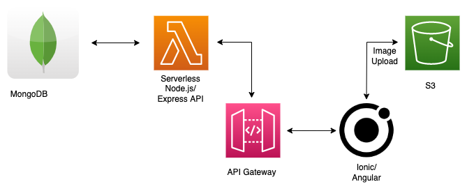

# Plantsky

An app to help you remember your plants.

## Getting Started

- [Download the installer](https://nodejs.org/) for Node LTS.
- Install the ionic CLI globally: `npm install -g ionic`
- Clone this repository.
- Run `npm install` from the project root.
- Run `ionic serve` in a terminal from the project root.
